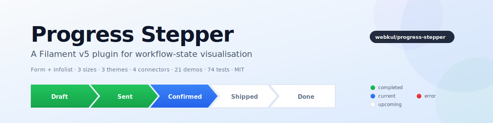

# Progress Stepper for Filament v5

[](https://packagist.org/packages/aureuserp/progress-stepper)
[](LICENSE.md)

A feature-rich **Filament v5** plugin that renders workflow state as an interactive arrow-stepper (form) or a read-only status bar (infolist). Built for business apps where orders, applications, or projects move through named states and you want every screen to show that progress visually.

<p align="center">
    <picture>
        <source media="(prefers-color-scheme: dark)" srcset="art/banner-dark.svg">
        
    </picture>
</p>

---

## Table of contents

- [Features](#features)
- [Requirements](#requirements)
- [Installation](#installation)
- [Theme setup](#theme-setup)
- [Quick start](#quick-start)
- [API reference](#api-reference)
  - [Options](#options)
  - [State behaviour](#state-behaviour)
  - [State colors](#state-colors)
  - [Layout](#layout)
  - [Per-step enrichment](#per-step-enrichment)
  - [Icons](#icons)
- [Enums](#enums)
- [Real-world example](#real-world-example)
- [Theming & customisation](#theming--customisation)
- [Overridable icons](#overridable-icons)
- [Translations](#translations)
- [Publishing resources](#publishing-resources)
- [Testing](#testing)
- [Troubleshooting](#troubleshooting)
- [Naming notes](#naming-notes)
- [Security](#security)
- [Contributing](#contributing)
- [Credits](#credits)
- [License](#license)

---

## Features

- **Form component** (extends `ToggleButtons`) — interactive radio/checkbox stepper
- **Infolist entry** — read-only status visualisation
- **4 state colors** — completed, current, upcoming, error — each overridable
- **Auto-mark completed** — `markCompletedUpToCurrent()` paints every step before the active one
- **Error states** — flag any states as danger via `errorStates([…])`
- **Hide states conditionally** — `hideStatesFor(fn)` based on the current record
- **BackedEnum integration** — `optionsFromEnum(MyStatus::class)` auto-derives labels / icons / colors
- **Type-safe enums** — `Size::Large`, `Direction::Vertical`, `Theme::Outlined`, `ConnectorShape::Chevron`, `StepStatus::Completed` — strings still work for backwards compatibility
- **3 sizes** — sm / md / lg
- **2 directions** — horizontal / vertical
- **4 connector shapes** — arrow / chevron / dot / line
- **3 themes** — filled / outlined / minimal
- **Step numbering** — `showIndex()` prepends 1., 2., 3.
- **Icon-only (compact)** mode for tight navigation bars
- **Per-step content** — descriptions, tooltips, badges, icons
- **Overridable icons** via `FilamentIcon::register()`
- **Translations** shipped for `en` and `ar`
- **Full Pest test coverage** — 74 tests across architecture, API, status resolver, enum input, and component instantiation

---

## Requirements

- PHP 8.2+
- Laravel 11+
- Filament v5+
- Tailwind CSS (via a custom Filament theme if you use Panels)

---

## Installation

```bash
composer require aureuserp/progress-stepper
```

The service provider is auto-discovered. The component CSS is registered via `FilamentAsset` and published automatically during `artisan filament:assets`.

---

## Theme setup

> [!IMPORTANT]
> If you are using Filament **Panels** and have not set up a custom theme, follow [Creating a custom theme](https://filamentphp.com/docs/5.x/styling/overview#creating-a-custom-theme) first.

Add the plugin's Blade files to your theme's CSS so Tailwind picks up its utility classes:

```css
/* resources/css/filament/admin/theme.css */
@source '../../../../vendor/aureuserp/progress-stepper/resources/**/*.blade.php';
```

Then rebuild your theme:

```bash
npm run build
```

---

## Quick start

### Form component

```php
use Webkul\ProgressStepper\Forms\Components\ProgressStepper;

ProgressStepper::make('state')
    ->options([
        'draft'     => 'Draft',
        'sent'      => 'Sent',
        'confirmed' => 'Confirmed',
        'done'      => 'Done',
    ])
    ->default('draft');
```

### Infolist entry

```php
use Webkul\ProgressStepper\Infolists\Components\ProgressStepper;

ProgressStepper::make('state')
    ->options([
        'draft' => 'Draft',
        'sent'  => 'Sent',
        'done'  => 'Done',
    ]);
```

Both components extend normal Filament base classes (`ToggleButtons` and `Entry`), so all standard Filament methods — `->label()`, `->helperText()`, `->visible()`, `->columnSpanFull()`, `->state()` — still work.

---

## API reference

All methods return `static` so they chain. Each accepts either a scalar value or a `Closure` where applicable (per Filament's standard pattern).

### Options

```php
->options(array | Closure $options)               // ['value' => 'Label', …]
->optionsFromEnum(string $enumClass)              // derive from a BackedEnum
```

#### BackedEnum integration

Implement `HasLabel`, `HasColor`, `HasIcon` on your enum and every case's label / icon / color is picked up automatically:

```php
enum OrderStatus: string implements HasLabel, HasColor, HasIcon
{
    case Draft = 'draft';
    case Sent = 'sent';
    case Confirmed = 'confirmed';
    case Done = 'done';

    public function getLabel(): ?string
    {
        return match ($this) {
            self::Draft => __('orders.state.draft'),
            self::Sent => __('orders.state.sent'),
            self::Confirmed => __('orders.state.confirmed'),
            self::Done => __('orders.state.done'),
        };
    }

    public function getColor(): string | array | null
    {
        return match ($this) {
            self::Draft => 'gray',
            self::Sent => 'info',
            self::Confirmed => 'primary',
            self::Done => 'success',
        };
    }

    public function getIcon(): ?string
    {
        return match ($this) {
            self::Draft => 'heroicon-m-document',
            self::Sent => 'heroicon-m-paper-airplane',
            self::Confirmed => 'heroicon-m-check-badge',
            self::Done => 'heroicon-m-check-circle',
        };
    }
}

ProgressStepper::make('state')->optionsFromEnum(OrderStatus::class);
```

### State behaviour

```php
->markCompletedUpToCurrent(bool | Closure $condition = true)
    // Steps ordered before the current one take the completedColor. Default: false.

->errorStates(array | Closure $states)
    // Values that should render with errorColor. e.g. ['cancelled', 'rejected'].

->hideStatesFor(Closure $callback)
    // Callback returns an array of values to hide. Receives ['record' => …] if
    // used inside a resource form/infolist — see the real-world example below.
```

### State colors

Each slot accepts any Filament color token (`primary`, `success`, `warning`, `danger`, `info`, `gray`, custom) or a `Closure`.

```php
->completedColor(string | Closure $color)   // default: 'success'
->currentColor(string | Closure $color)     // default: 'primary'
->upcomingColor(string | Closure $color)    // default: 'gray'
->errorColor(string | Closure $color)       // default: 'danger'
```

### Layout

Each layout setter accepts either the dedicated **enum** (recommended — IDE autocomplete, compile-time checked) or the raw **string** (quick one-offs, backward compatible):

```php
use Webkul\ProgressStepper\Enums\{ConnectorShape, Direction, Size, Theme};

->size(Size::Large)                              // or ->size('lg')         — default: Size::Medium
->direction(Direction::Vertical)                  // or ->direction('vertical') — default: Direction::Horizontal
->theme(Theme::Outlined)                          // or ->theme('outlined')  — default: Theme::Filled
->connectorShape(ConnectorShape::Chevron)         // or ->connectorShape('chevron') — default: ConnectorShape::Arrow
->showIndex(bool | Closure $condition = true)     // prepend 1., 2., …
->iconOnly(bool | Closure $condition = true)      // hide labels, keep icons
->inline(bool | Closure $condition = true)        // align to the right of the field label
```

Unknown values silently fall back to the enum's `default()` case, so misspellings never crash a page.

### Per-step enrichment

Each accepts an `array<value, string|int>` OR a `Closure($value, $label, $state)`:

```php
->stepDescription(array | Closure $descriptions)   // subtitle under the label
->stepTooltip(array | Closure $tooltips)           // hover help (title attribute)
->stepBadge(array | Closure $badges)               // small pill with count/text
```

Example:

```php
->stepDescription([
    'draft' => 'Not yet sent',
    'sent'  => 'Awaiting response',
])
->stepBadge(fn (string $value) => $value === 'review' ? auth()->user()->unreadReviewCount() : null)
->stepTooltip(fn (string $value) => __("orders.stepper.{$value}.tooltip"))
```

### Icons

```php
->icons([                                   // available on both components
    'draft'     => 'heroicon-m-document',
    'sent'      => 'heroicon-m-paper-airplane',
    'confirmed' => 'heroicon-m-check-badge',
    'done'      => 'heroicon-m-check-circle',
])
```

The form component inherits `icons()` from `ToggleButtons`; the infolist component declares its own.

---

## Enums

The plugin ships five `BackedEnum`s under `Webkul\ProgressStepper\Enums` so you can use symbolic constants instead of magic strings. Every string value matches what the CSS `data-ps-*` attributes expect, so passing an enum produces the same rendered output as the equivalent string.

| Enum | Cases → values | Default |
|---|---|---|
| `Size` | `Small` → `'sm'`, `Medium` → `'md'`, `Large` → `'lg'` | `Size::Medium` |
| `Direction` | `Horizontal`, `Vertical` | `Direction::Horizontal` |
| `Theme` | `Filled`, `Outlined`, `Minimal` | `Theme::Filled` |
| `ConnectorShape` | `Arrow`, `Chevron`, `Dot`, `Line` | `ConnectorShape::Arrow` |
| `StepStatus` | `Completed`, `Current`, `Upcoming`, `Error` | (internal; returned by `getStepStatus()`) |

Each of the first four exposes a `default()` static method that returns the case used when no explicit value is set or when an unknown value falls through — useful for building resilient defaults in custom code.

### Enum usage

```php
use Webkul\ProgressStepper\Enums\ConnectorShape;
use Webkul\ProgressStepper\Enums\Direction;
use Webkul\ProgressStepper\Enums\Size;
use Webkul\ProgressStepper\Enums\Theme;
use Webkul\ProgressStepper\Forms\Components\ProgressStepper;

ProgressStepper::make('state')
    ->options([...])
    ->size(Size::Large)
    ->direction(Direction::Horizontal)
    ->theme(Theme::Outlined)
    ->connectorShape(ConnectorShape::Chevron);
```

### Interop with `getStepStatus()`

Need to inspect the classification of a step programmatically? Round-trip through `StepStatus::from(...)`:

```php
use Webkul\ProgressStepper\Enums\StepStatus;

$status = StepStatus::from($component->getStepStatus('confirmed'));

match ($status) {
    StepStatus::Completed => /* … */,
    StepStatus::Current   => /* … */,
    StepStatus::Upcoming  => /* … */,
    StepStatus::Error     => /* … */,
};
```

---

## Real-world example

Adapted from a Sales Order Resource — mirrors the aureuserp pattern, mixing the `Size` / `ConnectorShape` enums with a domain `OrderStatus` enum:

```php
use App\Enums\OrderStatus;
use Filament\Schemas\Schema;
use Webkul\ProgressStepper\Enums\ConnectorShape;
use Webkul\ProgressStepper\Enums\Size;
use Webkul\ProgressStepper\Forms\Components\ProgressStepper;

public static function form(Schema $schema): Schema
{
    return $schema->components([
        ProgressStepper::make('state')
            ->optionsFromEnum(OrderStatus::class)
            ->markCompletedUpToCurrent()
            ->errorStates([OrderStatus::Cancelled->value])
            ->hideStatesFor(fn ($record) => $record?->is_refunded
                ? []
                : [OrderStatus::Refunded->value])
            ->size(Size::Large)
            ->connectorShape(ConnectorShape::Chevron)
            ->showIndex()
            ->stepDescription([
                OrderStatus::Draft->value     => 'Not yet sent to the customer',
                OrderStatus::Confirmed->value => 'Customer has confirmed the quote',
            ])
            ->stepBadge(fn (string $value, $record) => match ($value) {
                OrderStatus::Sent->value => $record?->unread_comment_count ?: null,
                default                  => null,
            })
            ->columnSpanFull()
            ->disabled(),
    ]);
}
```

---

## Theming & customisation

### Custom colors

Any color registered on your panel flows through automatically. Just reference its key:

```php
// AdminPanelProvider
->colors(['magenta' => '#b72d81'])

// Usage
->currentColor('magenta')
```

### Extending the CSS

The plugin styles ship at `vendor/aureuserp/progress-stepper/resources/dist/progress-stepper.css`. Publish it if you want to fork it:

```bash
php artisan vendor:publish --tag="progress-stepper-config"
```

Or override selectors in your own theme CSS — the stable hooks are:

- `.ps-container` — outer wrapper
- `.ps-step` — each step wrapper
- `.ps-button` — the rendered stepper segment
- `.ps-label`, `.ps-label-text`, `.ps-index`, `.ps-description`, `.ps-badge` — inner label parts
- `data-ps-direction | data-ps-size | data-ps-theme | data-ps-separator | data-ps-compact | data-ps-inline` on `.ps-container` — values match the `Direction`, `Size`, `Theme`, `ConnectorShape` enum values
- `data-ps-status="completed | current | upcoming | error"` — values match `StepStatus` enum values
- `data-ps-color="primary | success | warning | danger | info | gray | <custom>"` — drives the `--ps-color-500` / `--ps-color-600` CSS variables that the filled / outlined / minimal themes consume

---

## Overridable icons

The plugin registers three aliases you can override globally:

```php
use Filament\Support\Facades\FilamentIcon;

FilamentIcon::register([
    'progress-stepper::step-completed' => 'phosphor-check-bold',
    'progress-stepper::step-current'   => 'phosphor-caret-right-bold',
    'progress-stepper::step-error'     => 'phosphor-x-bold',
]);
```

| Alias | Default |
|---|---|
| `progress-stepper::step-completed` | `heroicon-m-check` |
| `progress-stepper::step-current` | `heroicon-m-arrow-right` |
| `progress-stepper::step-error` | `heroicon-m-x-mark` |

---

## Translations

The plugin ships `en` and `ar` translations under the `progress-stepper::` namespace for status / separator / theme labels used internally.

Publish them to customise:

```bash
php artisan vendor:publish --tag="progress-stepper-translations"
```

Files appear in `lang/vendor/progress-stepper/{locale}/progress-stepper.php`.

---

## Publishing resources

```bash
# Config file (currently empty — reserved for future tuning knobs)
php artisan vendor:publish --tag="progress-stepper-config"

# Blade views
php artisan vendor:publish --tag="progress-stepper-views"

# Translations
php artisan vendor:publish --tag="progress-stepper-translations"
```

---

## Testing

The plugin ships with a full Pest test suite covering every public API surface.

```bash
vendor/bin/pest plugins/aureuserp/progress-stepper/tests/Feature
```

**74 tests** (148 assertions) across:

| Area | Coverage |
|---|---|
| Architecture | Components extend `ToggleButtons` / `Entry`, shared trait used on both, Plugin implements `Filament\Contracts\Plugin`, ServiceProvider extends Spatie `PackageServiceProvider`, no debug calls (`dd`, `dump`, `var_dump`, `ray`, `die`, `exit`) in shipped code |
| State colors | Defaults, scalar setters, closure setters, chaining |
| State behaviour | `markCompletedUpToCurrent`, `errorStates`, `hideStatesFor` |
| Layout API | `size`, `direction`, `theme`, `connectorShape`, `showIndex`, `iconOnly` — value acceptance and default-fallback |
| Content enrichment | `stepDescription`, `stepTooltip`, `stepBadge` — arrays, closures, empty-value coercion |
| Status resolver | `getStepStatus` / `getStepColor` across completed / current / upcoming / error; `errorStates` overrides; custom color overrides |
| Enum input | `Size::Large`, `Direction::Vertical` etc. produce the same strings as raw equivalents; string inputs still work; closures returning enums work |
| `optionsFromEnum` | Derives labels from `HasLabel`, icons from `HasIcon`, colors from `HasColor`; safely ignores non-enum classes |
| Component instantiation | Base class assertions, view paths, chainable API, `inline()`, `getColor()` delegation |

Fixtures live at `tests/Feature/Fixtures/` (only a `SampleStatus` BackedEnum).

---

## Troubleshooting

| Symptom | Likely cause | Fix |
|---|---|---|
| `Target class [Webkul\ProgressStepper\Forms\…] not found` | Autoload cache is stale | `composer dump-autoload && php artisan optimize:clear` |
| View `progress-stepper::forms.progress-stepper` not found | Service provider not registered | Check the provider is in `bootstrap/providers.php` or that package discovery ran (`php artisan package:discover`) |
| Steps render without arrows / colors | Theme didn't scan plugin Blade files | Add the `@source` directive shown in [Theme setup](#theme-setup) and rebuild the theme |
| Form component throws `Declaration of … must be compatible with Filament\Schemas\Components\Component::…` | You called one of the legacy methods (`separator()`, `compact()`, `description()`, `tooltip()`, `badge()`) which collide with Filament base traits | Use the prefixed names: `connectorShape()`, `iconOnly()`, `stepDescription()`, `stepTooltip()`, `stepBadge()` |

---

## Naming notes

Five method names on this plugin intentionally **differ** from the natural English word to avoid collisions with Filament's base traits:

| Natural name | Use this instead | Why |
|---|---|---|
| `separator()` | `connectorShape()` | `Component::separator()` takes `string\|null = ','` |
| `compact()` | `iconOnly()` | `CanBeCompact::compact()` exists |
| `description()` | `stepDescription()` | `HasDescription::description()` exists |
| `tooltip()` | `stepTooltip()` | `HasTooltip::tooltip()` exists |
| `badge()` | `stepBadge()` | `HasBadge::badge()` exists |

---

## Security

If you discover a security vulnerability, email `support@webkul.com` rather than opening a public issue.

---

## Contributing

PRs welcome. Please run the test suite before submitting:

```bash
vendor/bin/pest plugins/aureuserp/progress-stepper/tests/Feature
vendor/bin/pint plugins/aureuserp/progress-stepper       # code style
```

When adding a new configuration option, please:

1. Define (or extend) a `BackedEnum` under `src/Enums/` if the option is one of a fixed set of values.
2. Accept both the enum and the raw string in the setter signature for backward compatibility.
3. Add coverage to the relevant test file under `tests/Feature/Unit/`.
4. Document the option in the [API reference](#api-reference) and [Enums](#enums) sections as appropriate.

---

## Credits

- [Webkul](https://webkul.com) — plugin author
- [Filament team](https://filamentphp.com) — the excellent admin framework
- [filamentphp/plugin-skeleton](https://github.com/filamentphp/plugin-skeleton) — structural template

---

## License

MIT. See [LICENSE.md](LICENSE.md).
